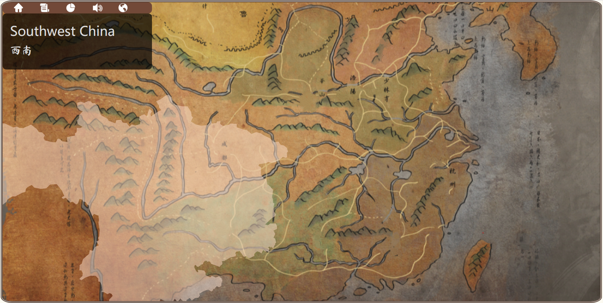

# The Way Home

[Link on Zeit](https://my-cdv-ss20.now.sh/my-work/final/index.html)

## Description
   The map of Songci is a web-based interactive map project. The project focuses on the cities appeared in Songci and picks out representative ones to make visulizations. As for interactive functions, this project includes diverse sound, art and story elements. Aiming at providing interactive experience for users to pursue a better understanding of this poetry style associated with the history of the Song Dynasty, this project will connect the historical information of cities to the map of Song to introduce diverse aspects and stories of Song Ci and the Song Dynasty.

## Creaters
   Sumner Feng

## Demos & Documentation
   [Video Documentation](https://drive.google.com/file/d/1jrCX50XkiGYFFLW6mcSsohhy0lL9VXaz/view?usp=sharing)

## Guide
   

## Ciations
   #### -For Dataset-
   Chinese Poetry by Jackey Gao from [Github](https://github.com/jackeyGao/chinese-poetry)

   (The processed data cateogorizing songci into regions are in the file "processeddata.xlsx")

   #### -For Code-
   JS Library: [D3.js](https://d3js.org/)

   #### -For Art Source-
   The background map: from [Tale of Wuxia: The Pre-Sequel](http://xkqz.fhyx.com/)

   The background images: by 喂了呜喵王 from [Pixiv](https://www.pixiv.net/artworks/63124911)

   #### -For Sound Source-
   The start page Bgm: 居所·结屋山涧曲 from 绘真·妙笔千山

   The welcome Bgm for the map: 千里江山图 from 绘真·妙笔千山

   The ordinary Bgm for the map: 孤鸟·凄然一方 from 绘真·妙笔千山

## Screenshots
   
   
   

## Update History
   2020.05.05: The first complete version

   2020.05.06: Added some buttons to the menu and added the descriptive readme file

   2020.05.07: Added project description and attached a new button to the menu

   2020.05.08: Added three cities (Jingzhou, Qionglai, and Xianyang)
               The info box would now response to other menu buttons

   2020.05.09: Added graph to the project and a button to control the volume of the Bgms

   2020.05.10: Fixed the x-axis bug and updated readme file
